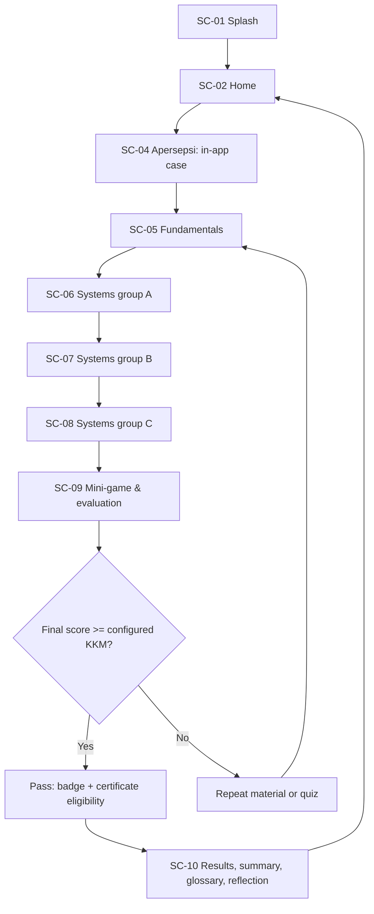

# Scene Flow, States, and Asset Mapping

## Primary learner flow

The 10-scene flow is `PROPOSED` planning baseline due to documented scene-count conflict AQ-001. The KKM branch, retry direction, and results content are `EXPLICIT`. Exact deep links, locking, resume, and whether repeat returns to selected material versus all material are `TBD`.

`DD-14` supersedes SC-03 as a screen: Home routes directly to SC-04, and every scene (including SC-02–SC-10) instead carries a reusable help/`?` icon button that opens a per-scene driver.js-style guided-tour overlay in place. The feature-to-scene trace and asset map below still list a "03" column/row for traceability with the PRD numbering, but it now means "cross-scene help overlay," not a distinct screen.

## Feature-to-scene trace

| Feature | SC-01 | 02 | 03 | 04 | 05 | 06 | 07 | 08 | 09 | 10 |
| --- | :---: | :---: | :---: | :---: | :---: | :---: | :---: | :---: | :---: | :---: |
| Branding/loading | ● | ○ |  |  |  |  |  |  |  |  |
| Eight-menu navigation |  | ● |  |  |  |  |  |  |  |  |
| Guidance (help overlay, cross-scene per `DD-14`) | ○ | ○ | ○ | ○ | ○ | ○ | ○ | ○ | ○ | ○ |
| Case/symptom mapping |  |  |  | ● |  |  |  |  | ○ |  |
| 3D organ exploration |  | ○ |  | ○ | ● | ● | ● | ● | ○ |  |
| Educational content |  |  |  |  | ● | ● | ● | ● |  | ● |
| Process visualisation |  |  |  |  | ○ | ● | ● | ● | ○ |  |
| Practice/game activity |  |  |  | ● | ● | ● | ● | ● | ● |  |
| MCQ / true-false |  |  |  |  |  |  |  |  | ● |  |
| Score/KKM |  | ● |  | ○ | ○ | ○ | ○ | ○ | ● | ● |
| Badge/certificate |  | ● |  |  |  |  |  |  | ○ | ● |
| Summary/glossary/reflection |  | ○ |  |  |  |  |  |  |  | ● |

`●` primary, `○` contextual or optional preview. All uses follow existing PRD FR-001–FR-024; no new feature is implied by this table.

## Scene-to-asset map

| Scene | P0 assets | Deferred / conditional assets |
| --- | --- | --- |
| SC-01 | BR-01, BR-02, UI-03 | BG-01, AU-02 |
| SC-02 | UI-01, AN-01, AN-02 | BG-02, RW-01, AU-03 |
| SC-03 (superseded, see above) | — | — |
| SC-04 | GM-01, GM-03, AN-02 | BG-04, AU-03 |
| SC-05 | AN-01–02, DI-01–02, GM-01 | BG-05, VD-01, AU-02 |
| SC-06 | AN-03–04, DI-02–03, GM-01 | AN-05, BG-06, VD-02, FX-01, audio |
| SC-07 | AN-06–08, DI-02–03, GM-01 | BG-07, VD-02, FX-01, audio |
| SC-08 | AN-10, DI-02–03, GM-01 | AN-09/11/12, GM-02, BG-08, VD-02, FX-01, audio |
| SC-09 | DI-03, GM-01, UI-02 | GM-02, BG-09, AU-02 |
| SC-10 | UI-02 | BG-10, RW-01–02, FX-02, AU-02 |

## Session and failure states

| State | Owner | Required treatment |
| --- | --- | --- |
| Orientation invalid | AppShell React | Guard blocks input and pauses canvas; auto-resolves in landscape. |
| Route/data loading | React route | Skeleton/message, retry and back path; lazy load by scene. |
| Phaser asset/scene failure | React host + Phaser bridge | Destroy failed instance; host shows recoverable error/retry; do not leave a dead canvas. |
| Activity incomplete | ActivityFrame | Keep objective and current work; retry/skip policy `TBD`. |
| Incorrect answer | FeedbackPanel | Correctness, explanation, permitted retry/next action; policy `TBD`. |
| KKM not met | Result flow | Clearly explain repeat choices; no shame framing or false certificate. |
| Reduced motion / muted audio | Settings/global | Static pathway/diagram and visible feedback remain complete. |
