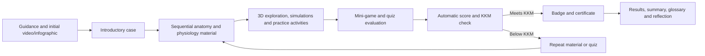
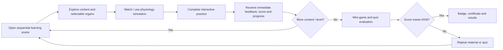
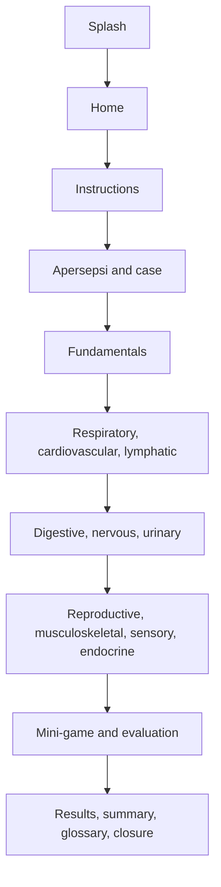

# AnatoQuest – Human Body Explorer

## Product Requirements Document

## 1. Document control

| Field | Value |
| --- | --- |
| Product name | AnatoQuest – Human Body Explorer |
| Official educational-material title | **Human Body Explorer: Anatomi Fisiologi** |
| Teaching-material type | **Bahan Ajar Digital Gim Edukasi Berbasis Video, Simulasi, dan Studi Kasus** |
| Programme | Layanan Kesehatan |
| Material code | **KES_LKES_7 No.196** |
| Status | Extracted requirements; ready for product/technical validation |
| PRD version | 1.0 |
| Source document | `docs/raw/bismilah Gim Lkes7.docx` |
| Extraction date | 2026-08-29 |

### Requirement classification

- **EXPLICIT**: directly stated in the proposal text, storyboard, flowchart, or supplied mock-up.
- **INFERRED**: a necessary logical reading of explicit evidence; it remains subject to validation.
- **PROPOSED**: a recommendation added to make implementation decisions testable. It is not a proposal requirement.
- **OPEN QUESTION / UNSPECIFIED**: the proposal does not determine the answer.

Evidence references use the proposal's named sections because the Word document has no stable printed page numbers: `A. Identitas`, `B. Deskripsi Umum`, `C. Alur Interaksi`, `D. Rencana Implementasi`, `E. Storyboard`, and `Storyboard Scene n`.

## 2. Product overview

AnatoQuest is a web-based, 16:9 single-page educational game and interactive multimedia learning experience for Grade X learners in the Layanan Kesehatan vocational concentration (Fase E). It teaches the fundamental meaning of anatomy and physiology and ten human-organ-system domains through learning material, a selectable 3D anatomy model, physiology animations, interactive simulations, case studies, mini-games, quizzes, feedback, and a completion experience.

The proposal addresses the need to help learners understand both body structure and function—and the relationship between them—through exploration and active practice rather than text alone. It is differentiated from a conventional digital textbook by selectable visual models, animations, simulations, activities, direct feedback, and game progression. It is differentiated from a conventional quiz application because learning content, organ exploration, simulations, a pre-learning case, practice activities, and evaluation are all part of the intended experience.

**Boundary:** AnatoQuest is **not a virtual laboratory**, laboratory simulator, experiment simulator, or clinical-diagnosis tool. The storyboard's “digital laboratory” wording describes a visual ambience only; no laboratory procedure or experiment is specified.

## 3. Product vision

### Proposal-derived vision — EXPLICIT

Enable learners to explore the human body “like a health worker” through one-screen interactive organ presentation; understand anatomy, physiology, and structure–function relationships; analyse simple symptom cases by organ system; and build awareness of maintaining health throughout life. (`B. Deskripsi Umum`)

### Proposed interpretation — PROPOSED

Make each learning interaction answer two linked questions: *what structure is this?* and *what does it do in the body?* Game mechanics should reinforce, not distract from, that connection.

## 4. Problem statement

| Area | Extracted statement | Type | Evidence |
| --- | --- | --- | --- |
| Educational problem | Learners need to understand anatomy, physiology, and relationships between organ structures and functions. | EXPLICIT | B; D: Pra-Pembelajaran |
| Learner task | Learners are expected to analyse simple symptoms in relation to affected organ systems and explain structure–function relationships. | EXPLICIT | B; D; Scene 4 |
| Why interactive multimedia | The proposal intends models, animations, simulation, cases, games, and direct feedback to make mechanisms more concrete, engaging, and enjoyable. | EXPLICIT | B; Scenes 5–9 |
| Existing-learning limitation | A specific baseline method, usability finding, or learning-outcome deficit is not quantified. | UNSPECIFIED | — |

## 5. Product goals

### Educational goals — EXPLICIT

1. Understand basic anatomy and physiology concepts.
2. Understand structures, functions, and coordination of human organ systems.
3. Understand relationships between organ structure and physiological function.
4. Analyse simple symptoms in relation to likely organ systems.
5. Build awareness of the importance of maintaining bodily health.

### Product goals — EXPLICIT

1. Provide web-based game-supported learning with video, simulation, case study, and interaction.
2. Give immediate feedback on activities.
3. Provide a staged learning path, score/progress feedback, badges, and certificate outcome based on KKM.

Engagement, exploration, retention, and assessment are intended outcomes where stated above; no numeric target is specified.

## 6. Target users

| Attribute | Requirement | Type |
| --- | --- | --- |
| Primary users | Murid kelas X konsentrasi keahlian layanan kesehatan fase E. | EXPLICIT |
| Educational programme | Layanan Kesehatan. | EXPLICIT |
| Use setting | Independent pre-learning, then individual or small-group (3–4 learners) computer/laptop learning in class. | EXPLICIT |
| Prior knowledge | Learners receive introductory material on anatomy, physiology, structure–function relationships, and body organisation before class. | EXPLICIT |
| Digital literacy | Level and onboarding threshold are not stated. | UNSPECIFIED |
| Teacher role | Facilitator: leads discussion, reinforces concepts, and helps learners with challenges. | EXPLICIT |

## 7. Learning objectives

The proposal does not provide a formally labelled learning-objective list or Bloom taxonomy. The following preserves its stated outcomes without assigning unsupported levels.

| Outcome grouping | Extracted learning outcomes | Type | Evidence |
| --- | --- | --- | --- |
| Knowledge / understanding | Explain anatomy and physiology; identify body organisation from cell to organ system; recognise organ structures and basic functions. | EXPLICIT | D; Scene 5 |
| Understanding relationships | Explain the relation between anatomy (structure) and physiology (function), including coordinated organ systems and homeostasis. | EXPLICIT | B; D; Scenes 5–8 |
| Application | Place organs anatomically, match structure to function, and sequence physiological pathways. | EXPLICIT | D; Scenes 5–9 |
| Analysis | Form an initial explanation of simple patient symptoms and implicated organ systems; later analyse a simple organ-system-disorder case. | EXPLICIT | D; Scene 4 |
| Reflection | Articulate benefits and difficulties experienced while completing levels. | EXPLICIT | D: Penutup dan Refleksi |

## 8. Curriculum / learning-content structure

```text
Human Anatomy & Physiology
│
├── Fundamentals
│   ├── Pengertian anatomi fisiologi tubuh manusia
│   ├── Relationship of structure and function
│   └── Organisation: cell → tissue → organ → organ system
│
├── Sistem pernafasan
├── Sistem jantung
├── Sistem pembuluh darah dan limfatik
├── Sistem pencernaan
├── Sistem persarafan
├── Sistem perkemihan
├── Sistem reproduksi
├── Sistem otot dan tulang
├── Sistem indra
└── Sistem endokrin
```

The proposal groups the material into Scene 6 (respiratory, heart/blood vessels, lymphatic), Scene 7 (digestive, nervous, urinary), and Scene 8 (reproductive, musculoskeletal, sensory, endocrine). These are authored scene groupings, **not** evidence that each domain must become a separate application module or level.

## 9. Learning-experience architecture

The stated learning path is: guidance and competency exploration before class; an introductory case; sequential material and organ-system interactions; mini-games and evaluation; automatic result calculation; KKM outcome; reflection/summary/glossary/closure. The experience also supports teacher-facilitated discussion.



## 10. Game concept

| Element | Requirement | Type |
| --- | --- | --- |
| Format | Web-based SPA, 16:9. | EXPLICIT |
| Genre | Educational game / interactive multimedia. A narrower game genre is not named. | EXPLICIT / UNSPECIFIED |
| Player objective | Complete learning sequentially, demonstrate understanding through activities and evaluation, and meet KKM. | EXPLICIT |
| Player actions | Select/inspect organs, swipe, click, hover, drag and drop, solve puzzles, match, sequence pathways, answer questions, and select case responses. | EXPLICIT |
| Challenges | Puzzle anatomy, matching structure/function, anatomical placement, pathway sequencing, labelling, mini-game, Boss Challenge, quizzes, and case study. | EXPLICIT |
| Rules | Rules, levels, success indicators, scores, badges, rewards, and activity types are introduced by the teacher; their exact rule values are absent. | EXPLICIT / UNSPECIFIED |
| Progression | Sequential scenes/levels; evaluation after material; KKM gate to success or repeat. | EXPLICIT |
| Failure | Below-KKM learners are directed to repeat material or quiz. In-activity failure/attempt rules are unspecified. | EXPLICIT / UNSPECIFIED |
| Rewards | Score, badges, certificate, and achievement badge system. | EXPLICIT |
| Feedback | Immediate feedback through colour changes, animation, sound effects, scientific explanation, score, badge, and progress bar; activity-specific automatic explanations. | EXPLICIT |

### Core gameplay loop



## 11. Identified mechanics

The detailed mechanics specification is maintained in [04-game-mechanics.md](04-game-mechanics.md). Identified mechanics are: selectable/rotatable 3D anatomy exploration; drag-and-drop classification, placement, and sequencing; structure–function matching; anatomy puzzle; labelling; mini-game; Boss Challenge; quiz; simple case analysis; immediate feedback; score/progress; KKM decision; badges; certificate; summary/glossary/reflection. All are **EXPLICIT** except implementation rules marked `UNSPECIFIED` or `PROPOSED` there.

## 12. Interactive multimedia

| Medium | Expected behaviour / learning role | Type | Evidence |
| --- | --- | --- | --- |
| Introductory video | Pre-learning coverage of introductory anatomy/physiology, structure–function relations, and body organisation. | EXPLICIT | D: Pra-Pembelajaran |
| Interactive infographic | Available in pre-learning; detailed content/interaction unspecified. | EXPLICIT / UNSPECIFIED | D |
| 3D anatomy model | 360° rotation; selectable major organs; highlight, name, location, and basic function. Home screen model auto-rotates and selected organs light up. | EXPLICIT | Scenes 2, 5 |
| Physiology animation | Respiratory cycles/gas exchange, heartbeat/blood flow/lymph circulation, food journey, neural impulse, urine formation, muscle contraction, hormone release, senses, reproductive function as applicable. | EXPLICIT | Scenes 5–8 |
| Interactive simulation / visualization | Organ-system simulations and interactive material support learning; simulation fidelity and controls are not specified. | EXPLICIT / UNSPECIFIED | B; Scenes 6–8 |
| Case study | Introductory patient-symptom interaction plus evaluation case-study type. | EXPLICIT | D; Scenes 4, 9 |
| Audio | SFX, educational/opening/evaluation/closing music, and low-volume ambience by scene. Narration/dialogue text is supplied. Audio controls and narration playback are unspecified. | EXPLICIT / UNSPECIFIED | Storyboard Scenes 1–10 |
| Visual/UI animation | Fade-in, glow, zoom, pulse, highlights, confetti, and staged result presentation. | EXPLICIT | Storyboard Scenes 1–10 |

## 13. Case-study system

| Aspect | Requirement | Type |
| --- | --- | --- |
| Purpose | Build curiosity before core learning; prompt analysis of symptoms, organs/systems, and structure–function relationship. | EXPLICIT |
| Pre-learning case | 55-year-old male: shortness of breath, chest pain radiating to left arm, cold sweat, increased blood pressure, irregular heart rate; learner writes an initial hypothesis and scientific rationale. | EXPLICIT |
| Scene 4 case | 18-year-old male in IGD: shortness of breath, palpitations, fatigue, pallor; learner selects or drags symptoms to related organs. | EXPLICIT |
| Feedback | Selected organ highlighted; short feedback says the answer will be explored in subsequent material. After all symptoms, automatic initial score and short explanation. | EXPLICIT |
| Evaluation case | Case study is listed as an evaluation activity. Scenario format, scoring rubric, and response modality are unspecified. | EXPLICIT / UNSPECIFIED |
| Clinical safety boundary | The case is educational and simple; clinical diagnosis, treatment recommendation, and patient management workflow are not specified. | INFERRED |

## 14. Assessment / evaluation

Assessment consists of interactive practices during learning and Scene 9 evaluation: Organ Puzzle, Organ–Function Matching, Drag and Drop Sistem Organ, multiple-choice quiz, true–false quiz, and case study. The system automatically processes answers, calculates a final score, and compares it against KKM. After `Periksa Jawaban`, it records an answer, shows an active selection, and presents feedback. The learner can use swipe or `Berikutnya` to change question. Meeting/exceeding KKM yields pass, badge, and certificate; otherwise the learner repeats material or quiz.

**UNSPECIFIED:** KKM threshold, score weights, question count/bank, randomisation, attempt limits, answer review, partial-credit rules, pass label, and whether the early-case score affects the final score.

## 15. User flows

See [02-user-flows.md](02-user-flows.md) for the detailed Mermaid flows. The proposal-supported high-level route is:



The storyboard calls this ten scenes, while the implementation plan says Scene 02 through Scene 12. This is a contradiction recorded in [08-open-questions.md](08-open-questions.md).

## 16. Information architecture

### Proposal-supported navigation

```text
Application
├── Splash Screen
├── Home / Beranda
│   ├── Mulai Pembelajaran
│   ├── Materi
│   ├── Simulasi Organ
│   ├── Mini Game
│   ├── Kuis
│   ├── Glosarium
│   ├── Profil
│   └── Petunjuk
├── Petunjuk Penggunaan
├── Apersepsi dan Studi Kasus
├── Learning Scenes (Fundamentals and organ-system groups)
├── Mini Game dan Kuis Evaluasi
└── Hasil Belajar / Rangkuman / Glosarium / Penutup
```

The relationships between home-menu deep links and the required sequential level route are **UNSPECIFIED**. Separate `Progress`, `Profile`, and `Simulasi Organ` screen definitions beyond the listed menus are **UNSPECIFIED**. Do not create additional information architecture as an extracted requirement.

## 17. Functional requirements

The implementation-ready requirement catalogue is in [03-feature-specifications.md](03-feature-specifications.md). It contains **25 core requirements**, including the current project directive for a global visual art system. The explicit set is traceable in [07-requirement-traceability.md](07-requirement-traceability.md).

## 18. Non-functional requirements

| Area | Requirement / status | Type |
| --- | --- | --- |
| Platform | Web-based SPA. | EXPLICIT |
| Display format | 16:9. | EXPLICIT |
| Desktop use | Computer/laptop use is planned. | EXPLICIT |
| Touch/mobile interaction | Swipe is specified for mobile/tablet touch use. Exact device support, breakpoints, and orientation are unspecified. | EXPLICIT / UNSPECIFIED |
| Interaction latency / FPS / load time | No target specified. | UNSPECIFIED |
| Browser support | UNSPECIFIED. | OPEN QUESTION |
| Offline / PWA | UNSPECIFIED. | OPEN QUESTION |
| Accessibility | No accessibility criteria, captions, contrast standard, keyboard behaviour, or reduced-motion requirements are specified. | OPEN QUESTION |
| Privacy / security / authentication | UNSPECIFIED. | OPEN QUESTION |
| Reliability / recovery | UNSPECIFIED. | OPEN QUESTION |
| Maintainability / content authoring | UNSPECIFIED. | OPEN QUESTION |

## 19. UI/UX requirements

### Proposal requirements — EXPLICIT

- A 16:9 web SPA with scenes and a futurist digital-anatomy visual theme.
- Home: a 360° auto-rotating holographic body, progress percentage, learning level, and badge count; eight named menu cards.
- Material scenes: selectable/highlighted organs, panels for information, 3D/diagram visualisations, simulation/animation, and activity controls.
- Interaction vocabulary includes normal, hover, hit/click, swipe, show, and drag/drop states.
- Hover may use glow/scale/shadow; clicks lead to feedback or scene transitions; touch users can swipe applicable content.
- Immediate feedback uses object colour, animation, SFX, concept explanation, score, badge, and progress bar.
- Result scene exposes final score, completion percentage, badge, certificate, summary, glossary, reflection, and retry/home/finish actions.
- Named colours, Poppins typography, background asset names, virtual instructor, and visual treatments appear in the storyboard and are visual-direction requirements, subject to asset/licence validation.

### Design recommendations — PROPOSED

- Preserve keyboard-operable equivalents for every drag/drop, hover, and swipe action.
- Provide audio mute/volume and caption/transcript controls; respect reduced-motion preferences.
- Treat the visual “laboratory” as an anatomy-learning theme only, never as a laboratory workflow.

### Global visual art direction — EXPLICIT project directive

Visual consistency is a **system-level requirement**. Backgrounds, buttons, icons, panels, illustrations, anatomy/educational diagrams, characters, Phaser game objects, and generated assets must share one modern 2D educational vector game visual language. Consistency has priority over photorealism, visual spectacle, or an individual asset’s aesthetic.

The required visual language is clean 2D illustration with simplified flat shapes, crisp/subtle consistent outlines, soft gradients, controlled transparency, gentle highlights, rounded approachable geometry where appropriate, layered depth without photorealism, a mature and trustworthy scientific/educational tone, and no visually overwhelming treatment. It must not become a hospital dashboard, virtual laboratory, laboratory simulator, or realistic scientific visualisation.

All assets use the established deep anatomy navy `#12355B`, pale blue `#D6F0FF`, cyan `#38BDF8`, supporting blue/teal tones, and documented restrained semantic warm accents. Lighting remains soft and controlled; excessive neon glow, bloom, specular highlights, cinematic contrast, arbitrary saturated colours, photographic/3D-render environments, and generic stock imagery are non-compliant. The detailed rules, approval checklist, and mandatory AI-prompt language are in `docs/design/04-game-visual-language.md`.

## 20. Screen / scene inventory

See [06-screen-scene-inventory.md](06-screen-scene-inventory.md). The proposal explicitly describes Scenes 1–10. Figures in the source include visual mock-ups of splash, home, instruction, case study, four content screens, evaluation, and results.

## 21. Content model and data requirements

See [05-content-model.md](05-content-model.md). Explicitly needed experience data includes answers, scores, final value, completion percentage/progress, achieved badges, and certificate eligibility/display. Persistence, identity, teacher dashboards, back-end storage, analytics, and data retention are **UNSPECIFIED**.

## 22. Asset requirements

| Category | Required asset / use | Status |
| --- | --- | --- |
| Backgrounds | `bg_splash_humanbody.png`, `bg_home_anatomi.png`, `bg_instruction.png`, `bg_case.png`, `bg_material01.png`, `bg_system_respiratory_cardiovascular.png`, `bg_digestive_nervous_urinary.png`, `bg_reproductive_musculoskeletal_sensory_endocrine.png`, `bg_quiz_game.png`, `bg_finish.png`. | EXPLICIT storyboard names |
| Educational visuals | 3D body/anatomy model, organ diagrams/illustrations, physiology visualisations, holographic panels. | EXPLICIT |
| UI assets | Logo, buttons/icons, progress bar, badges, certificate, score/graph elements, glossary/mind map elements. | EXPLICIT |
| Case visuals | Patient, symptom icons, body/organs, IGD setting. | EXPLICIT |
| Audio | Scene SFX, music, ambience, and supplied narration/dialogue content. | EXPLICIT |
| Asset files / formats / licences / source ownership | Not supplied. | UNSPECIFIED |

The proposal embeds storyboard mock-ups; these are visual references, not delivered production assets unless separately transferred and licensed.

All visual asset production, purchase, adaptation, or AI generation must also satisfy the global art direction and consistency checklist in `docs/design/04-game-visual-language.md`; this applies equally to React UI and Phaser assets.

## 23. Educational content requirements

Content must include the definition and relationship of anatomy and physiology; body organisation; the ten listed organ-system domains; structures and functions; relevant pathway/process content; simple symptom cases; activity instructions/items; questions and answers; scientific explanations/feedback; summary; glossary; and reflection prompts. It must preserve health-education accuracy. Detailed authoring scope is in [01-learning-content.md](01-learning-content.md). Exact curriculum references, medical-content review workflow, full topic depth, question bank, and citations are **UNSPECIFIED**.

## 24. Analytics and success metrics

The proposal requires learner-facing score, progress/completion percentage, badges, and final result display, but does **not** request implementation analytics, telemetry, reporting, or numerical success metrics.

**PROPOSED for approval:** track privacy-appropriate local or approved-server events for module/activity start/completion, answer submission, evaluation completion, retry, and certificate eligibility. Do not implement analytics until storage, consent, and ownership are decided.

Educational/product/engagement/technical targets are **UNSPECIFIED**; the only explicit success gate is meeting KKM, whose numeric value is absent.

## 25. Technical constraints and existing-project compatibility

The proposal mandates a web-based SPA in 16:9 and anticipates computer/laptop, mobile, and tablet interactions. It does not prescribe React, Vite, Phaser, Three.js, Unity, Godot, a database, a back end, or a rendering engine.

Repository inspection on 2026-08-29 found no implementation files, package manifest, or existing application architecture—only the proposal under `docs/raw`. Therefore there is no existing architecture to map or preserve. Technology selection remains **OPEN QUESTION** and must follow a later implementation decision, not this extraction.

## 26. Requirement traceability

The complete requirement-to-evidence mapping is in [07-requirement-traceability.md](07-requirement-traceability.md). The compact evidence matrix below was used to avoid scope drift.

| ID | Proposal evidence | Interpretation | Type | Confidence |
| --- | --- | --- | --- | --- |
| E-001 | A. Identitas | Preserve official title, material type, programme, code, audience, and content scope. | EXPLICIT | High |
| E-002 | B. Deskripsi Umum | Web 16:9 SPA; game/multimedia learning rather than a quiz-only product. | EXPLICIT | High |
| E-003 | B; Scenes 5–8 | 3D anatomy, animation, simulation, cases, quizzes, mini-games, drag/drop, puzzle. | EXPLICIT | High |
| E-004 | C. Alur Interaksi | Ten-scene sequence and KKM decision route. | EXPLICIT | High |
| E-005 | D. Rencana Implementasi | Classroom and pre-learning context, activities, feedback, and teacher role. | EXPLICIT | High |
| E-006 | Storyboard Scene 2 | Home menus, 3D model, progress, level, badge indicators, touch interaction. | EXPLICIT | High |
| E-007 | Storyboard Scene 4 | Case interaction and initial-score feedback. | EXPLICIT | High |
| E-008 | Storyboard Scenes 5–8 | Organ-specific visualisations, selectable organs, pathways, and practice. | EXPLICIT | High |
| E-009 | Storyboard Scene 9 | Evaluation formats, answer check, scoring, next-question movement. | EXPLICIT | High |
| E-010 | Storyboard Scene 10 | Results, summary, glossary, certificate, retry/home/finish actions. | EXPLICIT | High |
| E-011 | Proposal describes educational cases only | Do not treat case interaction as clinical diagnosis/treatment. | INFERRED | High |
| E-012 | Drag/drop, hover, swipe specified | Equivalent accessible interaction is needed for inclusive implementation. | PROPOSED | Medium |

## 27. Ambiguities and contradictions

See [08-open-questions.md](08-open-questions.md). The highest-impact ambiguity is the scene/level numbering: flowchart/storyboard defines Scenes 1–10, while the implementation plan instructs completion from Scene 02 to Scene 12. KKM threshold and scoring rules are also absent.

## 28. Missing requirements

The proposal does not determine: authentication/user identity; persistence and save/resume; KKM value; score/attempt rules; content depth/question bank; accessibility; audio controls; browser/device support; orientation/breakpoints; offline/PWA; performance targets; privacy/security; analytics; asset licence/source; content-review/medical validation; certificate data/issuance; teacher reports; and error/recovery behaviour. These are tracked as `MISSING-*` in [08-open-questions.md](08-open-questions.md).

## 29. Proposed decisions

Recommendations are deliberately separated in [09-proposed-decisions.md](09-proposed-decisions.md). They include accessibility-equivalent interactions, explicit content-review governance, a transparent assessment configuration, and a resolution strategy for the conflicting scene count. None should be treated as source requirements before approval.

## 30. MVP definition

### MVP — proposal-aligned interpretation

1. The stated web 16:9 learning journey: splash, home, instructions, simple case, fundamentals, all ten system domains in the four storyboard learning groupings, evaluation, and results.
2. Selectable anatomy visualisation, physiology visualisations/simulations appropriate to the stated content, and the explicitly named practice/evaluation types.
3. Immediate feedback, score/progress, KKM result route, badge/certificate result, summary, glossary, and retry route.

### Post-MVP — PROPOSED

Separate home deep-link destination screens for every menu item where those screens are not already defined; expanded achievement design; teacher-facing reporting; richer content authoring tools.

### Future — PROPOSED

Optional account sync, offline/PWA delivery, advanced analytics, and additional cases—only after requirements are approved.

## 31. Product scope

| In scope | Out of scope | Unknown / TBD |
| --- | --- | --- |
| Anatomy/physiology educational game; all ten content domains; multimedia; interactive practice; case studies; quiz/evaluation; feedback; progress/reward/result experience. | Virtual laboratory, laboratory experiments, chemistry procedures, clinical diagnosis or treatment, and unsupported technology commitments. | Authentication, storage, performance, browser support, accessibility standard, offline use, analytics, licensing, KKM/scoring details, and implementation architecture. |

## 32. Risk analysis

| Risk | Why it matters | Mitigation status |
| --- | --- | --- |
| Medical/educational accuracy | Learners are in a health-services programme and act on structure–function explanations and cases. | Content-expert validation is planned in the proposal; acceptance criteria are unspecified. |
| Scope/asset complexity | Ten systems, 3D models, animations, simulations, audio, and multiple activities create high production load. | Explicit risk; prioritise approved MVP and asset plan. |
| Assessment validity | KKM, scoring weights, and retry/attempt rules are absent. | Resolve before implementation. |
| Interaction accessibility | Drag/drop, hover, sound, motion, and touch may exclude some learners. | PROPOSED accessible alternatives. |
| Performance/device fit | 3D and animation may stress supported devices; limits are absent. | Define supported device/performance budgets. |
| Terminology/scene inconsistency | Conflicting 10 vs. 12 scene references can create divergent builds. | Resolve in product validation. |

## 33. Final requirement summary

```text
Product: AnatoQuest – Human Body Explorer
Primary users: Murid kelas X konsentrasi keahlian layanan kesehatan fase E
Educational goal: Understand anatomy, physiology, and structure–function relationships; apply this to simple organ-system symptoms
Core experience: Web SPA learning journey combining 3D organ exploration, animation/simulation, activities, cases, and evaluation
Major features: Ten content domains, 3D anatomy, interactive practice, case study, mini-game/quiz, immediate feedback, score/progress, badges/certificate, summary/glossary/reflection
Learning domains: Fundamentals plus respiratory; heart; blood/lymphatic; digestive; nervous; urinary; reproductive; musculoskeletal; sensory; endocrine systems
Assessment: Puzzle, matching, drag/drop, multiple choice, true/false, and case study; automatic scoring against KKM
Platform: 16:9 web SPA; desktop/laptop plus stated touch/swipe use
Known constraints: Educational game/multimedia—not a virtual laboratory; no technology choice supplied
Major unknowns: KKM/scoring, persistence, accessibility, browser/device targets, asset rights, analytics, and scene-count conflict
MVP: Full stated learning and evaluation arc with all ten domains and core interaction/feedback/result requirements
```
