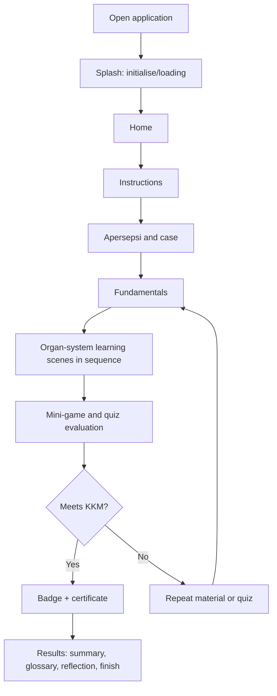
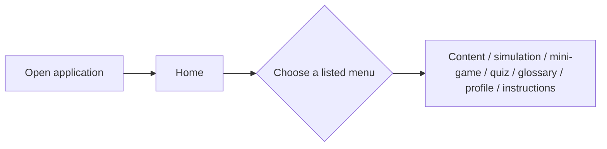
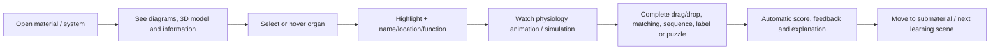
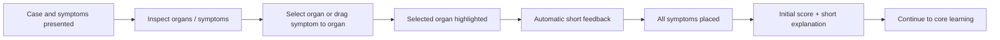
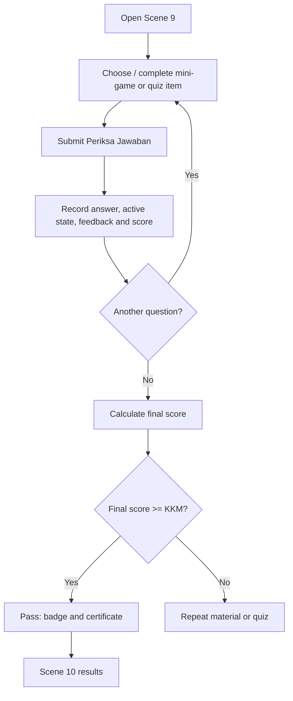

# User Flows

**Parent:** [00-product-requirements.md](00-product-requirements.md). All flows reproduce the proposal's intended route; unlabelled routing rules remain `UNSPECIFIED`.

## UF-01 First-time / guided learning — EXPLICIT

## UF-02 Returning learner — INFERRED

The proposal lists these menu choices but does not specify persisted progress, resume point, locking, or deep-link permissions. It is therefore not evidence of a save/resume feature.

## UF-03 Learning module activity — EXPLICIT

## UF-04 Case study — EXPLICIT

## UF-05 Evaluation and result — EXPLICIT

## Flow constraints

- The proposal explicitly says core learning runs in order by level, but Home exposes several menu choices. Whether direct menu access bypasses the sequence is **UNSPECIFIED**.
- `Back`, exit confirmation, mid-activity retry, loading/error state, and progress resume are **UNSPECIFIED**.
- Scene numbering is inconsistent (1–10 vs. 02–12); see [08-open-questions.md](08-open-questions.md).

