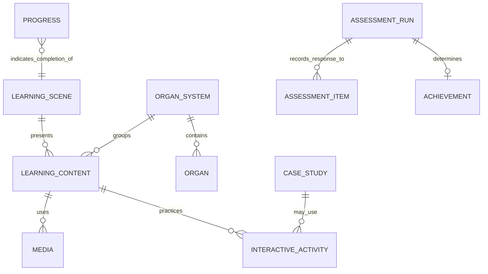

# Conceptual Content and Data Model

**Parent:** [00-product-requirements.md](00-product-requirements.md). This is a conceptual model, not a database or technology prescription.

| Entity | Purpose | Important fields / relationships | Status / source |
| --- | --- | --- | --- |
| LearningScene | Represents the proposal's scene-based learning route. | id, title, order, entry/exit actions, content references. Groups 1–10. | EXPLICIT — C; E |
| LearningContent | Explains a concept/system. | title, body, system/domain, structure/function text, summary reference. Belongs to scene/group. | EXPLICIT — A; Scenes 5–8 |
| OrganSystem | Organises the ten stated learning domains. | id, Indonesian name, group scene, content references. | EXPLICIT — A |
| Organ | Supports selectable 3D anatomy information. | name, location, basic function, visual/model reference, system. | EXPLICIT — Scene 5 |
| Media | Video, infographic, 3D model, animation, simulation, illustration, audio. | type, source/asset reference, scene, transcript/caption status. | EXPLICIT; accessibility metadata PROPOSED |
| InteractiveActivity | Practice task such as drag/drop, matching, sequence, label, or puzzle. | id, instructions, items, correct response, feedback, score rule. Links content. | EXPLICIT — D; Scenes 5–9 |
| CaseStudy | Educational symptom scenario. | prompt, patient scenario, symptoms, interaction, feedback, score rule. | EXPLICIT — D; Scene 4; Scene 9 |
| AssessmentItem | Evaluation question/task. | type (MCQ/true-false/activity/case), prompt, options, correct answer, explanation, score. | EXPLICIT — Scene 9 |
| AssessmentRun | A learner's evaluation result. | submitted answers, calculated final score, KKM comparison, outcome. Persistence unspecified. | EXPLICIT / UNSPECIFIED |
| Progress | Learner-facing material completion/percentage/level status. | progress percentage, level, completed scenes. Persistence unspecified. | EXPLICIT / UNSPECIFIED — D; Scene 2 |
| Achievement | Badge/certificate outcome. | badge identity, award condition, certificate display/download reference. Criteria/file format unspecified. | EXPLICIT / UNSPECIFIED |
| GlossaryEntry | Brief explanation of an anatomy/physiology term. | term, definition, related content. | EXPLICIT — Scene 10 |
| ReflectionPrompt | Closure reflection. | prompt; response/persistence status. | EXPLICIT / UNSPECIFIED — D |

## Relationships

## Data requirements

| Data | Requirement | Classification |
| --- | --- | --- |
| Temporary interaction state | Selected organ, drag positions, active answer, current question/scene. | INFERRED — necessary to provide specified behaviours |
| Answers and scores | Record evaluation answers; calculate activity/final score. | EXPLICIT |
| Progress data | Display learning percentage, level, and badge count; result displays completion percentage/graph. | EXPLICIT |
| Outcome data | Store/display KKM comparison, badge, and certificate eligibility for current outcome. | EXPLICIT / INFERRED |
| Persistent user progress | Whether data survives closing/reopening is not stated. | UNSPECIFIED |
| Identity / profile data | Profile is a home menu label; user model, authentication, and fields are not stated. | UNSPECIFIED |
| Teacher data / reporting | No data/report dashboard is stated. | UNSPECIFIED |
| Analytics / consent / retention | No implementation analytics, consent, or retention policy is stated. | UNSPECIFIED |

## Proposed data decisions

- `PROPOSED`: keep question/feedback/score rules as content configuration rather than embedded UI logic.
- `PROPOSED`: do not collect personal data or transmit analytics until identity, storage, consent, and retention decisions are approved.

